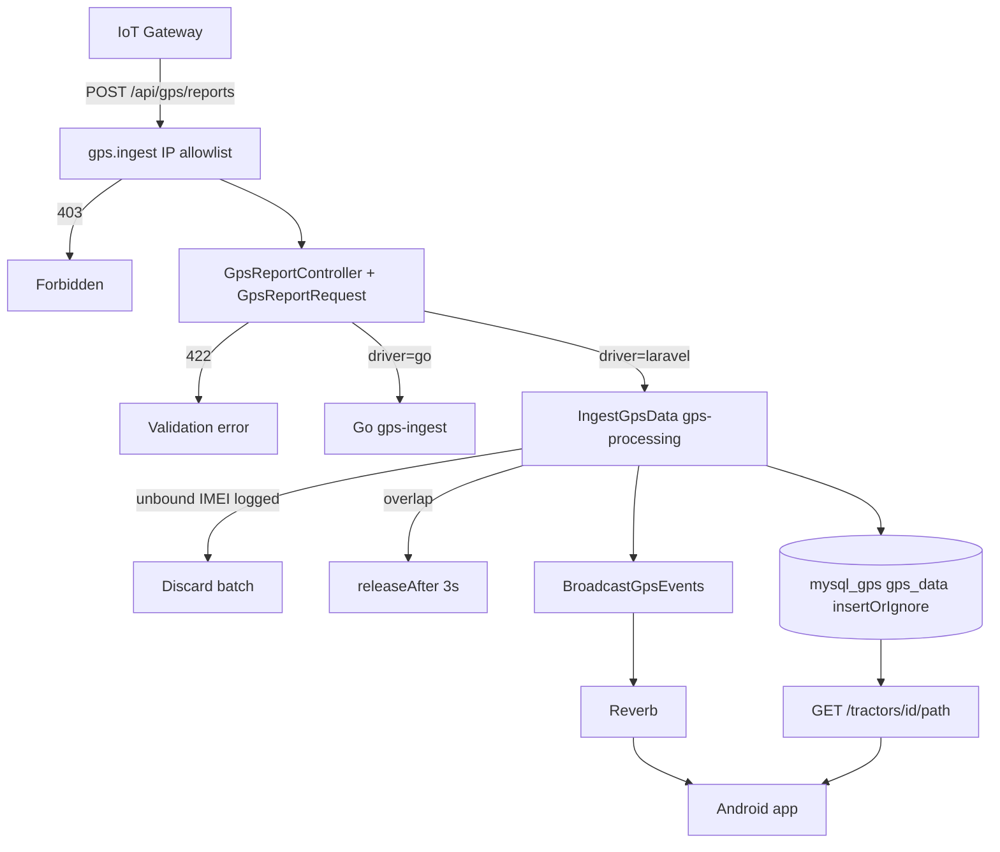

# PiStat GPS Ingestion & Android Safety Audit

**Scope:** `backend-api-main` (current tree)  
**Date:** 2026-07-30  
**Constraint:** Live Kotlin Android app is immutable — public REST/WS contracts must not change.  
**Note:** Legacy jobs `ProcessGpsData` / `StoreGpsData` were consolidated into **`IngestGpsData`**. All resilience work targets that job and internal middleware only.

---

## 1. GPS log flow (Controller → Queue → DB)

```text
IoT Gateway
        │
        ▼
POST /api/gps/reports
  middleware group: gps.ingest
    • SubstituteBindings
    • EnsureGpsIngestAllowed  ← IP allowlist (403 if not listed)
    • NO throttle:api (60/min) — unlimited for allowlisted gateway IPs
        │
        ▼
GpsReportController
  • GpsReportRequest validation (required fields; strips empty objects)
  • if GPS_INGEST_DRIVER=go → HTTP proxy to Go gps-ingest service
  • else → IngestGpsData::dispatch($data)
  • success path: HTTP 200 { "success": true }
        │
        ▼
Queue: gps-processing
        │
        ▼
IngestGpsData
  • WithoutOverlapping(imei) + releaseAfter(3)  [not dontRelease]
  • resolve tractor via Cache (imei → GpsDevice→tractor, 1h) + GpsDeviceCache
  • unbound IMEI → Log::warning + return (no store)
  • prepareBatch() whitelist + sanitize; skip/log bad rows
  • mysql_gps insertOrIgnore in 1000-chunks; row-by-row recovery on chunk failure
  • BroadcastGpsEvents::dispatch(...)
        │
        ▼
BroadcastGpsEvents (redis / default)
  • TractorStatus → channel tractor.status
  • ReportReceived → private gps_devices.{id}
        │
        ├─► Reverb WS → Android GpsDeviceWebSocketService
        └─► ReportReceivedListener → TractorTaskService
```

**Related (not tractor gateway ingest):**

| Path | Role |
|------|------|
| `POST /api/attendance/gps-report` | Labour phone GPS → `attendance_gps_data` |
| `POST /api/mobile/connect` | Device pairing |
| `GET /api/tractors/{tractor}/path` | Historical path stream (Android) |
| `services/gps-ingest/` (Go) | Optional cutover ingest (`GPS_INGEST_DRIVER=go`) |

---

## 2. Silent drop / delay / validation bottlenecks

### A. HTTP / middleware / FormRequest

| Trigger | Effect | Severity |
|---------|--------|----------|
| **IP not in `GPS_REPORTS_RATE_LIMIT_EXEMPT_IPS`** | **403** Forbidden — batch never queued | High (ops misconfig) |
| **`GpsReportRequest` validation fail** | **422** — malformed frames rejected (not silent) | Medium (gateway must send valid shape) |
| Empty `{}` objects in `data[]` | Filtered in `prepareForValidation` | Benign |
| Empty `data` after filter | 422 `min:1` | Explicit reject |
| No HDOP / speed-cap / orchard geofence on gateway ingest | Frames not quality-filtered server-side | Info |
| Go driver path: Go service down / timeout | Proxy may return non-200 to gateway | Ops |

Validation rules (gateway): `imei`, `coordinate[2]`, `date_time`, `speed` (≥0 int), `status` ∈ {0,1}, `directions.ew/ns` — all **required**. No silent drop at this layer; failures are HTTP errors.

### B. `IngestGpsData` (internal)

| Trigger | Effect | Severity |
|---------|--------|----------|
| Unbound IMEI (no tractor) | Batch discarded; **warning logged** | Silent store-drop (now observable) |
| Empty / missing `data[0].imei` | Warning + return | Rare |
| `WithoutOverlapping` contention | Job **released** after 3s (retry), not discarded | Delay, not drop |
| Bad row after sanitize | Skip + warning; other rows continue | Partial drop |
| DB chunk failure | Row-by-row `insertOrIgnore`; only unrecoverable rows logged/dropped | Partial |
| Duplicate `(imei, date_time)` | `insertOrIgnore` — no error | Dedup (by design) |
| Cache TTL 1h after reassignment | Wrong/null tractor until cache expires | Delay / skew |
| First-item IMEI only for tractor resolve | Mixed-IMEI batch attributed to first IMEI’s tractor | Data skew |
| Queue backlog (`gps-processing` workers) | Ingest delay | Delay |

### C. Downstream display (not ingest loss)

| Location | Behavior |
|----------|----------|
| `TractorPathStreamService` | Named-column SELECT; may omit some points from **display** via stoppage heuristics |
| Path correction (Median/Kalman) | Transforms coords; does not drop DB rows |
| Identical `date_time` in stream | Later identical timestamps skipped in display loop |

### D. Historical / out-of-order / offline buffer

- No reorder or clock-correction on write; points stored with payload `date_time`.
- Path/metrics readers use `ORDER BY date_time ASC`.
- Unique index on `(imei, date_time)` + `insertOrIgnore` prevents duplicate offline replays.
- Partitioned `gps_data` (RANGE on `date_time`): extreme historical dates still depend on partition health (ops).

---

## 3. `gps_data` schema (as used by ingest)

**Insert whitelist (`IngestGpsData::prepareBatch`):**

`tractor_id`, `coordinate`, `speed`, `status`, `directions`, `imei`, `date_time`

**Notable migrations:**

- Create + daily RANGE partition  
- `device_id` → `gps_device_id` (historical rename; ingest uses **`tractor_id`**)  
- coordinate/directions as string  
- Unique `(imei, date_time)` for idempotent ingest (`2026_07_14_000001_...`)  

**`rtc_resynced`:** not present in current schema/job. Do not expose via mobile JSON if re-added later; keep internal-only + path SELECT whitelist.

**Batch semantics (after resilience fix):**

1. Prefer bulk `insertOrIgnore` on `mysql_gps` inside a transaction per chunk.  
2. On failure → per-row `insertOrIgnore`; log and skip bad rows.  
3. If zero rows succeed and an error occurred → rethrow for job retry.

---

## 4. Mobile App Safety Guarantee

### Verdict

Internal ingest changes (`IngestGpsData`, overlap release, sanitize, `mysql_gps` inserts, IP allowlist) **do not alter** Android-facing REST/WS JSON shapes when:

1. Public mobile routes, status codes, and keys stay unchanged.  
2. Path/active/device endpoints keep **explicit Resources / formatters** (no `SELECT *` / raw `GpsData` models).  
3. Any future `gps_data` columns are additive and never projected into mobile responses unless Android is updated.

### Evidence — Android-facing surfaces

| Surface | Serialization | Exposes raw `gps_data` / new ingest columns? |
|---------|---------------|-----------------------------------------------|
| `GET /tractors/{id}/path` | `formatPointArray` — `id`, `latitude`, `longitude`, `speed`, `status`, `is_*`, `directions`, `stoppage_time`, `timestamp` | **No** — SQL selects named columns only |
| Active tractors | `ActiveTractorResource` | **No** |
| GPS devices CRUD | `GpsDeviceResource` | **No** |
| WS `report-received` | Whitelisted fields in `ReportReceived::broadcastWith()` | **No** |
| WS `tractor.status.changed` | `tractor`, `status` | **No** |
| Ingest `POST /gps/reports` | `{success:true}` / 422 / 403 | Not used by app for path DTOs |

### Explicit guarantees for this fix set

| Change | Android-safe? |
|--------|----------------|
| `IngestGpsData` sanitize + row recovery | Yes — internal job only |
| `WithoutOverlapping` + `releaseAfter(3)` | Yes |
| Unbound IMEI logging | Yes |
| Keep `insertOrIgnore` on `mysql_gps` | Yes |
| IP allowlist / no `throttle:api` on ingest | Gateway-only; mobile auth routes unchanged |
| Changing path/WS field names or types | **Forbidden** |
| Returning Eloquent `GpsData` / `SELECT *` to mobile | **Forbidden** |

---

## 5. Flow diagram



---

## 6. Deploy readiness checklist

- [x] Audit updated for current `IngestGpsData` architecture  
- [x] `mysql_gps` insert path confirmed  
- [x] Overlap silent-drop fixed (`releaseAfter(3)`)  
- [x] Unbound IMEI warning logged  
- [x] Per-row sanitize + recovery; duplicates via `insertOrIgnore`  
- [x] Gateway not under `throttle:api` (IP allowlist instead)  
- [x] Mobile path/WS contracts untouched  
- [ ] Server: set `GPS_REPORTS_RATE_LIMIT_EXEMPT_IPS` to real gateway IPs  
- [ ] Server: `php artisan migrate` (unique imei/date_time if not applied)  
- [ ] Server: supervisor/horizon workers listening on `gps-processing`  
- [ ] Optional: `GPS_INGEST_DRIVER=laravel` until Go cutover validated  

---

## 7. Files touched for resilience (this pass)

| File | Change |
|------|--------|
| `app/Jobs/IngestGpsData.php` | Overlap release, unbound log, sanitize, mysql_gps recovery inserts |
| `tests/Unit/Jobs/IngestGpsDataTest.php` | Logging, middleware, skip-bad-row coverage |
| `PISTAT_GPS_AUDIT.md` | This report |

**Not modified:** `android-app/**`, `Pistat Frontend/**`, mobile Resources, path JSON keys, WS broadcast field lists.

---

*Audit + internal resilience only. No public Android API contract changes.*
