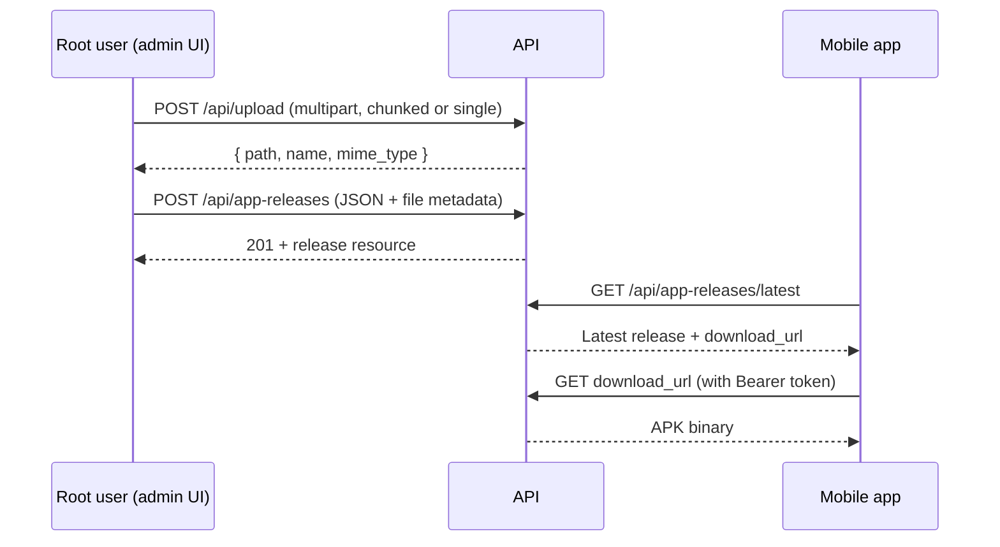

# App Release & File Upload API — Frontend Documentation

This document describes how to integrate **APK file uploads** and **application release** endpoints from web or mobile clients.

---

## Overview

| Item | Value |
|------|--------|
| **Base path** | `/api` |
| **Authentication** | Required — Laravel Sanctum `Bearer` token |
| **Username** | User must have a `username` set (`ensure.username` middleware) |

### Endpoints summary

| Method | Endpoint | Description | Role |
|--------|----------|-------------|------|
| `POST` | `/api/upload` | Upload APK (single or chunked) | Any authenticated user |
| `POST` | `/api/app-releases` | Publish a new release | **root** only |
| `GET` | `/api/app-releases/latest` | Get the newest published release | Any authenticated user |
| `GET` | `/api/app-releases/{id}/download` | Download the APK package | Any authenticated user |

---

## Authentication

Include a valid Sanctum token on every request:

```http
Authorization: Bearer {your-sanctum-token}
Accept: application/json
```

For **file upload** (`POST /api/upload`), use `multipart/form-data` and still send the `Authorization` header. You do not need to send a CSRF token when using Bearer authentication.

---

## Recommended flow (publish a release)

Large APK files should be uploaded in two steps: first stage the file, then create the release record.



1. **Upload** the APK to `POST /api/upload` until the response includes `path`, `name`, and `mime_type` (not a progress percentage).
2. **Create release** with `POST /api/app-releases`, passing that file metadata in the `file` object.
3. **Check for updates** with `GET /api/app-releases/latest`.
4. **Download** using `data.download_url` from the release resource (same auth token required).

---

## 1) File upload

Upload an APK (or other binary) before creating a release. Supports **single-request** uploads and **chunked** uploads for large files.

### Request

```http
POST /api/upload
Content-Type: multipart/form-data
Authorization: Bearer {token}
```

| Field | Type | Required | Description |
|-------|------|----------|-------------|
| `file` | File | Yes | The file binary (form field name must be `file`) |

### Response — upload complete (`200 OK`)

When the full file has been received and saved:

```json
{
  "path": "upload/application-octet-stream/2026-05-20/",
  "name": "pistat-v1.0.0_abc123def456.apk",
  "mime_type": "application-octet-stream"
}
```

| Field | Description |
|-------|-------------|
| `path` | Directory prefix (relative). Combine with `name` when sending to create-release. |
| `name` | Stored filename (original name + hash suffix). |
| `mime_type` | MIME type with `/` replaced by `-` (e.g. `application/octet-stream` → `application-octet-stream`). |

**Important:** Pass `path`, `name`, and `mime_type` **exactly as returned** into `POST /api/app-releases`. Do not reconstruct paths on the client.

### Response — chunk in progress (`200 OK`)

While a chunked upload is still assembling:

```json
{
  "done": 45
}
```

| Field | Description |
|-------|-------------|
| `done` | Upload progress percentage (`0`–`100`). |

Keep sending chunks until the response returns `path`, `name`, and `mime_type` instead of `done`.

### Single-file upload (small APK)

For smaller files, send the entire file in one `multipart/form-data` request with field `file`. The server responds immediately with `path`, `name`, and `mime_type`.

**Example (JavaScript / Fetch):**

```javascript
const formData = new FormData();
formData.append('file', apkFile); // File from <input type="file"> or picker

const response = await fetch(`${API_BASE}/upload`, {
  method: 'POST',
  headers: {
    Authorization: `Bearer ${token}`,
    Accept: 'application/json',
  },
  body: formData,
});

const data = await response.json();
// data.path, data.name, data.mime_type → use in create release
```

### Chunked upload (large APK)

For large APKs, use a chunked upload library compatible with [resumable.js](https://github.com/23/resumable.js) conventions (e.g. [Resumable.js](https://github.com/23/resumable.js) or Dropzone with chunking enabled).

**Target URL:** `POST /api/upload`

**Typical Resumable.js setup:**

```javascript
const resumable = new Resumable({
  target: `${API_BASE}/upload`,
  chunkSize: 1 * 1024 * 1024, // 1 MB — tune to your server limits
  simultaneousUploads: 1,
  testChunks: false,
  headers: {
    Authorization: `Bearer ${token}`,
    Accept: 'application/json',
  },
});

resumable.on('fileSuccess', (file, message) => {
  const data = JSON.parse(message);
  // data.path, data.name, data.mime_type → use in create release
});

resumable.addFile(apkFile);
resumable.upload();
```

While chunks are uploading, intermediate responses look like `{ "done": 42 }`. On the **last** chunk, the response switches to the final `path` / `name` / `mime_type` object.

### Upload errors

| Status | When |
|--------|------|
| `401` | Missing or invalid token |
| `403` | Authenticated but user has no `username` |
| `4xx/5xx` | Missing `file`, failed chunk assembly, or server error |

Always send `Accept: application/json` so error responses are JSON, not HTML redirects.

---

## 2) Create app release

Registers a new published version and attaches the APK staged by `/api/upload`.

### Request

```http
POST /api/app-releases
Content-Type: application/json
Authorization: Bearer {token}
```

**Authorization:** **root** role only. Other roles receive `403 Forbidden`.

#### Body

```json
{
  "version": "v12.0.11",
  "release_notes": "Bug fixes and performance improvements.",
  "file": {
    "path": "upload/application-octet-stream/2026-05-20/",
    "name": "pistat-v12.0.11_abc123def456.apk",
    "mime_type": "application-octet-stream"
  }
}
```

| Field | Type | Required | Rules |
|-------|------|----------|--------|
| `version` | string | Yes | Unique. Max 50 chars. Pattern: `v{major}.{minor}.{patch}` with optional prerelease/build suffix. |
| `release_notes` | string | No | Max 20,000 characters. |
| `file` | object | Yes | Metadata from upload response. |
| `file.path` | string | Yes | From upload `path`. |
| `file.name` | string | Yes | From upload `name`. |
| `file.mime_type` | string | Yes | From upload `mime_type`. |

#### Version format

Must match:

```text
v{major}.{minor}.{patch}[optional-suffix]
```

| Valid | Invalid |
|-------|---------|
| `v1.0.0` | `1.0.0` (missing `v`) |
| `v2.1.0` | `v1.0` (incomplete semver) |
| `v3.0.0-beta.1` | `v1.0.0.0` (too many segments) |
| `v1.0.0+build.1` | |

Regex (for client-side validation): `^v\d+\.\d+\.\d+(?:[-+][A-Za-z0-9.-]+)?$`

### Response — success (`201 Created`)

Wrapped in a `data` key (Laravel API resource):

```json
{
  "data": {
    "id": 12,
    "version": "v12.0.11",
    "release_notes": "Bug fixes and performance improvements.",
    "published_at": "2026-05-21T10:30:00+00:00",
    "download_url": "https://your-api.example.com/api/app-releases/12/download",
    "file": {
      "name": "pistat-v12.0.11_abc123def456.apk",
      "size": 52428800,
      "mime_type": "application/vnd.android.package-archive"
    },
    "created_by": 1,
    "created_at": "2026-05-21T10:30:00+00:00"
  }
}
```

| Field | Description |
|-------|-------------|
| `id` | Release ID. |
| `version` | Published version string. |
| `release_notes` | Notes or `null`. |
| `published_at` | ISO 8601 publish timestamp (set automatically on create). |
| `download_url` | Absolute URL for downloading the APK (requires auth). |
| `file.name` | Stored package filename. |
| `file.size` | Package size in bytes. |
| `file.mime_type` | Package MIME type. |
| `created_by` | User ID of the publisher. |
| `created_at` | ISO 8601 creation timestamp. |

### Response — validation error (`422 Unprocessable Entity`)

```json
{
  "message": "The version has already been taken. (and 1 more error)",
  "errors": {
    "version": ["The version has already been taken."],
    "file.path": ["The file.path field is required."]
  }
}
```

Common validation cases:

| Field | Error |
|-------|--------|
| `version` | Missing, invalid format, or duplicate |
| `file`, `file.path`, `file.name`, `file.mime_type` | Missing or invalid |
| `release_notes` | Exceeds 20,000 characters |

### Other errors

| Status | When |
|--------|------|
| `401` | Not authenticated |
| `403` | Not `root`, or user has no `username` |
| `422` | Validation failed |

**Example (full publish flow):**

```javascript
// Step 1: upload (see File upload section)
const uploadRes = await fetch(`${API_BASE}/upload`, {
  method: 'POST',
  headers: { Authorization: `Bearer ${token}`, Accept: 'application/json' },
  body: formData,
});
const staged = await uploadRes.json();

// Step 2: create release
const releaseRes = await fetch(`${API_BASE}/app-releases`, {
  method: 'POST',
  headers: {
    Authorization: `Bearer ${token}`,
    Accept: 'application/json',
    'Content-Type': 'application/json',
  },
  body: JSON.stringify({
    version: 'v12.0.11',
    release_notes: 'Bug fixes and performance improvements.',
    file: {
      path: staged.path,
      name: staged.name,
      mime_type: staged.mime_type,
    },
  }),
});

const { data: release } = await releaseRes.json();
```

---

## 3) Get latest release

Returns the most recently published release. Use this for in-app update checks.

### Request

```http
GET /api/app-releases/latest
Authorization: Bearer {token}
Accept: application/json
```

**Authorization:** Any authenticated user with a `username`.

### Response — success (`200 OK`)

Same shape as the create-release `data` object:

```json
{
  "data": {
    "id": 12,
    "version": "v12.0.11",
    "release_notes": "Bug fixes and performance improvements.",
    "published_at": "2026-05-21T10:30:00+00:00",
    "download_url": "https://your-api.example.com/api/app-releases/12/download",
    "file": {
      "name": "pistat-v12.0.11_abc123def456.apk",
      "size": 52428800,
      "mime_type": "application/vnd.android.package-archive"
    },
    "created_by": 1,
    "created_at": "2026-05-21T10:30:00+00:00"
  }
}
```

**Selecting “latest”:** The server orders by `published_at` descending, then `id` descending.

### Response — not found (`404 Not Found`)

Returned when no releases exist yet. Show “no updates” or hide the update UI.

### Client update-check pattern

```javascript
const res = await fetch(`${API_BASE}/app-releases/latest`, {
  headers: {
    Authorization: `Bearer ${token}`,
    Accept: 'application/json',
  },
});

if (res.status === 404) {
  // No releases published
  return;
}

const { data: latest } = await res.json();

if (latest.version !== installedVersion) {
  // Prompt user to update; download from latest.download_url
}
```

---

## 4) Download release package

Downloads the APK binary for a specific release.

### Request

```http
GET /api/app-releases/{id}/download
Authorization: Bearer {token}
```

| Parameter | Type | Description |
|-----------|------|-------------|
| `id` | integer | Release ID from `data.id` or from `download_url` |

You may call either the named route URL from `download_url` or build the path as `/api/app-releases/{id}/download`.

**Authorization:** Any authenticated user with a `username`.

### Response — success (`200 OK`)

- **Content-Type:** Binary (APK / octet stream)
- **Content-Disposition:** `attachment; filename="..."` with the package filename

Do not expect JSON. Save the response body as a file (e.g. `.apk`).

**Example:**

```javascript
const url = latest.download_url; // or `/api/app-releases/${latest.id}/download`

const res = await fetch(url, {
  headers: { Authorization: `Bearer ${token}` },
});

if (!res.ok) throw new Error('Download failed');

const blob = await res.blob();
// Write blob to disk (platform-specific) and trigger install
```

On **React Native / mobile**, use your HTTP client’s download-to-file API with the same `Authorization` header. Opening `download_url` in a browser without the token will fail.

### Response — not found (`404 Not Found`)

| Case | Meaning |
|------|---------|
| Invalid `id` | Release does not exist |
| Missing package | Release exists but has no APK attached |

---

## Error handling reference

| HTTP status | Typical cause |
|-------------|----------------|
| `401 Unauthorized` | No token or expired session |
| `403 Forbidden` | User has no `username`, or non-root calling create release |
| `404 Not Found` | No releases for `latest`, or missing/invalid download |
| `422 Unprocessable Entity` | Invalid or duplicate `version`, missing `file` fields |
| `201 Created` | Release published successfully |

For JSON endpoints, always send:

```http
Accept: application/json
```

---

## UI notes

### Admin (root) — publish screen

1. File picker → upload to `/api/upload` with progress bar (use `done` for chunked uploads).
2. Form fields: `version`, `release_notes` (optional).
3. On upload complete, submit create release with staged `file` metadata.
4. Show returned `data.version` and `data.download_url` on success.

### Mobile app — update screen

1. `GET /api/app-releases/latest` on launch or from settings.
2. Compare `data.version` with the installed app version.
3. If newer, download via `data.download_url` with Bearer token.
4. Use `data.file.size` for progress UI and `data.release_notes` for the update dialog.

### Permissions recap

| Action | root | operator / other roles |
|--------|------|-------------------------|
| Upload file | Yes | Yes |
| Create release | Yes | No (`403`) |
| Latest release | Yes | Yes |
| Download APK | Yes | Yes |

---

## Quick reference — cURL

**Upload file:**

```bash
curl -X POST "https://your-api.example.com/api/upload" \
  -H "Authorization: Bearer {token}" \
  -H "Accept: application/json" \
  -F "file=@/path/to/app.apk"
```

**Create release:**

```bash
curl -X POST "https://your-api.example.com/api/app-releases" \
  -H "Authorization: Bearer {token}" \
  -H "Accept: application/json" \
  -H "Content-Type: application/json" \
  -d '{
    "version": "v12.0.11",
    "release_notes": "Bug fixes.",
    "file": {
      "path": "upload/application-octet-stream/2026-05-20/",
      "name": "pistat-v12.0.11_abc123.apk",
      "mime_type": "application-octet-stream"
    }
  }'
```

**Latest release:**

```bash
curl -X GET "https://your-api.example.com/api/app-releases/latest" \
  -H "Authorization: Bearer {token}" \
  -H "Accept: application/json"
```

**Download APK:**

```bash
curl -X GET "https://your-api.example.com/api/app-releases/12/download" \
  -H "Authorization: Bearer {token}" \
  -o app.apk
```
