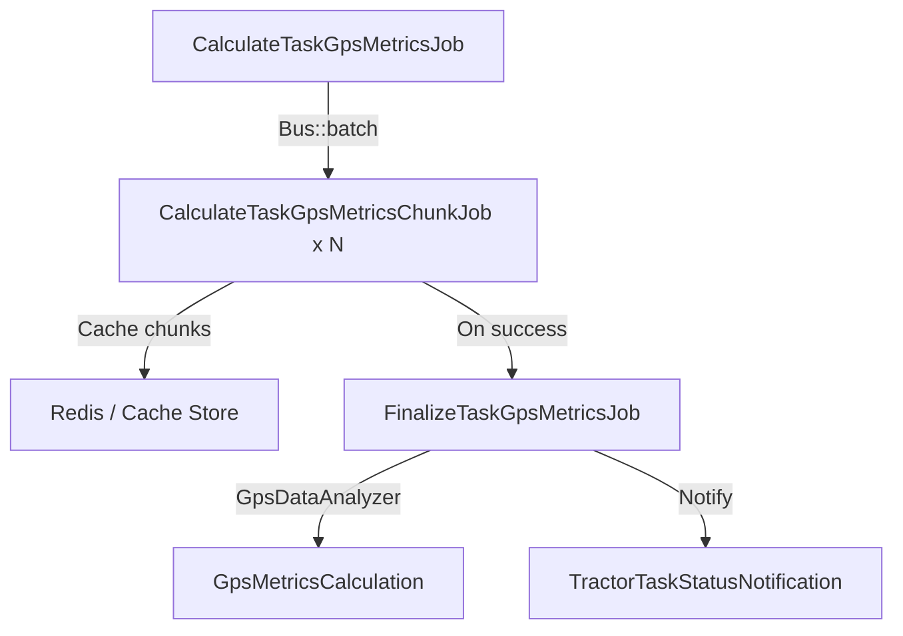

# Task GPS Metrics Queue Pipeline

## Overview

`CalculateTaskGpsMetricsJob` now orchestrates task-level GPS metric calculations as a lightweight dispatcher.  
Instead of loading all GPS points in a single job, it streams work through a batch of chunk workers and finalizes the metrics once all chunks succeed.



## Job Roles

- **CalculateTaskGpsMetricsJob**
  - Validates tractor, time window, and task zone.
  - Dispatches chunk jobs inside a batch; one chunk per `TASK_GPS_METRICS_CHUNK_SIZE`.
  - Stores batch metadata at `task-gps-metrics:{taskId}:meta`.
  - Applies `RateLimited('task-gps-metrics')` and `WithoutOverlapping`.

- **CalculateTaskGpsMetricsChunkJob**
  - Streams a bounded set of GPS rows and filters them by polygon.
  - Writes normalized payloads to cache: `task-gps-metrics:{taskId}:chunk:{index}`.
  - Uses `RateLimited('task-gps-metrics-chunks')` and `WithoutOverlapping`.

- **FinalizeTaskGpsMetricsJob**
  - Runs after the batch finishes successfully.
  - Merges cached chunk payloads and reuses `GpsDataAnalyzer->analyzeLight()`.
  - Updates `GpsMetricsCalculation` and notifies farm admins.
  - Cleans up cache entries.
  - Uses `RateLimited('task-gps-metrics-finalizer')` and `WithoutOverlapping`.

## Configuration

All tunables live in `config/queue.php` and can be overridden via `.env`.

| Setting | Default | Description |
| --- | --- | --- |
| `TASK_GPS_METRICS_CHUNK_SIZE` | `500` | Rows fetched per chunk job |
| `TASK_GPS_METRICS_RATE_LIMIT` | `30` | Max orchestrator starts per minute |
| `TASK_GPS_METRICS_CHUNK_RATE_LIMIT` | `45` | Max chunk executions per minute |
| `TASK_GPS_METRICS_FINAL_RATE_LIMIT` | `15` | Max finalize runs per minute |

Rate limiters are registered in `App\Providers\AppServiceProvider`. Adjusting the env values immediately throttles queue throughput without code changes.

## Operational Notes

- **Queue selection**: Jobs inherit the queue name from the dispatcher. If you dispatch on `gps-metrics`, all chunk and finalize jobs stay on the same queue.
- **Cache backend**: The cache store that backs the `Cache` facade should be shared by all workers (Redis recommended). TTL is 6 hours.
- **Failure handling**: Batch failures trigger cache cleanup and mark the task `not_done`.
- **Monitoring**: Use `php artisan queue:batch-table` or Horizon to watch batch progress; batch name is `calculate-task-gps-metrics::{taskId}`.

## Adjusting Throughput

1. Update `.env` with new limits, e.g.:
   ```env
   TASK_GPS_METRICS_CHUNK_SIZE=250
   TASK_GPS_METRICS_RATE_LIMIT=20
   TASK_GPS_METRICS_CHUNK_RATE_LIMIT=30
   TASK_GPS_METRICS_FINAL_RATE_LIMIT=10
   ```
2. Restart queue workers to pick up configuration changes.

Smaller chunk sizes reduce peak memory per worker. Lower rate limits intentionally slow ingestion to keep database load manageable.

## Worker Recommendations

```bash
# Dedicated worker pool for task GPS metrics (database queue example)
php artisan queue:work database --queue=gps-metrics --tries=3 --timeout=900 --sleep=3
```

Use separate workers if task metrics should not compete with efficiency jobs. Supervisord configs mirror the pattern in `deploy/supervisor/`.


